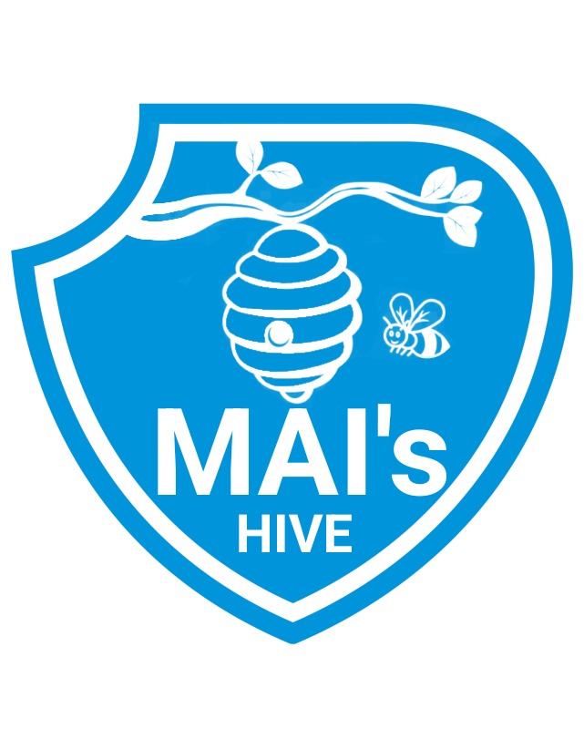

# Проект команды MAI's Hive

**Тема:** Система автоматического анализа электронного документа (PDF)

## Навигация

- [Паспорт проекта](docs/passport.pdf)
- [Презентация концепции проекта](docs/presentation.pdf)
- [Ресёрч-док](docs/research-doc.md)

### Диаграммы

- [Диаграмма архитектуры бэкенда](docs/diagram-backend.png)
- [Диаграмма БД](docs/diagram-database.png)
- [Диаграмма компонентов](docs/diagram-component.png)
- [Диаграмма контекстов](docs/diagram-context.jpg)
- [Диаграмма юз-кейсов](docs/diagram-use-cases.jpg)

### Код

- [Бэкенд](code/backend)
- [Фронтенд](code/frontend)

## Запуск

Проект можно запустить через Docker Compose. Для этого в `code/` предоставлены два Compose-файла: `docker-compose.yml` и `docker-compose.mock.yml` (с json-server вместо бэкенда). Поскольку бэкенд ещё находится в разработке, рекомендуется использовать файл `.mock` 🚀.